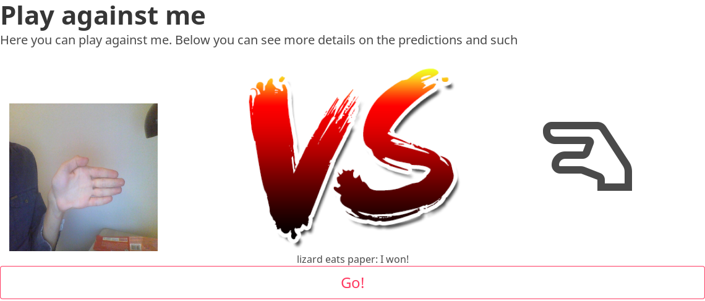
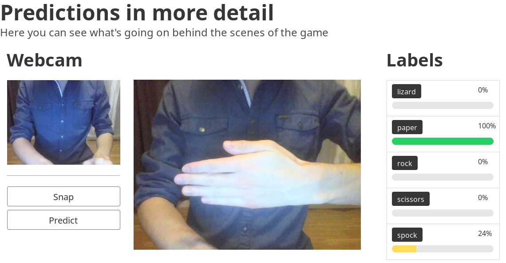
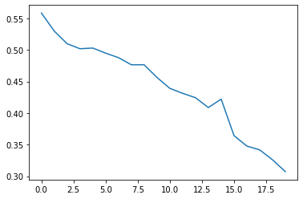
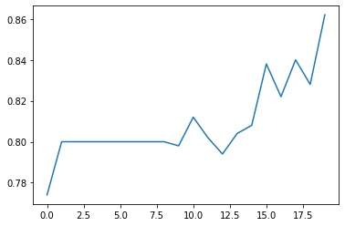
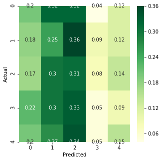

# TF Rock-Paper-Scissors-Lizard-Spock

This is a project for our university course 'AKT'.

## What does it do

The project has two parts: The jupyter notebook and a small website.

The jupyter notebook has a page where we train a neural network
in order to recognize (preprocessed) images as one of our five
classes: `rock`, `paper`, `scissors`, `lizard` or `spock`.
It reaches an accuracy of around 90%.
The notebook also has a few graphs to analyze the model.

The website on the other hand gives a nice interface over
which you can do one of two things:

- Play a totally fair game of _"rock paper scissors lizard
spock" against the AI



- Taking a picture of you signing one of the five symbols
    and figuring out what the network thinks the picture
    most likely contains.



## How to start

In order to use this repository, you need `docker` and
`docker-compose` installed and running on your device, as well
as having access to a linux shell.

### Step 1: Downloading the images

Since the images would've been too big to put into this
repository, we instead opted to create a download script that
will automatically download it from the github repository
[akshaybahadur21/Emojinator](https://github.com/akshaybahadur21/Emojinator/tree/master/Rock_Paper_Scissor_Lizard_Spock/RPS_data).

Simply execute `sh get_training_data.sh` and wait for it to be done.
Sadly, we found that downloading them parallely (using
`curl --parallel`) results in many of them being corrupted, so
this step takes a very long time.

### Step 2: Starting the docker containers

If you've docker and docker-compose installed, simply run

```sh
docker-compose up --build
```

> Note: Depending on your setup you'll most likely need `sudo` for it

This will start all three containers:

- The notebook
- The website
- The api

All of the data inside of the `jupyter/volume` folder is shared
with the outside, but anything else stays
inside of the docker container and as such will disappear once
you re-start it.

### Step 3: Look at the results

To connect to the jupyter notebook, simply visit
`localhost:8888` with any browser and use the password
`aktmodel` to access the notebook.

Similarly, you can access the website at `localhost:80`.
If you haven't yet created a model with the jupyter notebook
(using the downloaded images), it will not be able to predict
the images, however.

Here are the results for our model:


> Loss


> Accuracy


> Confusion Matrix